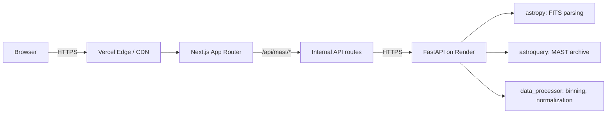
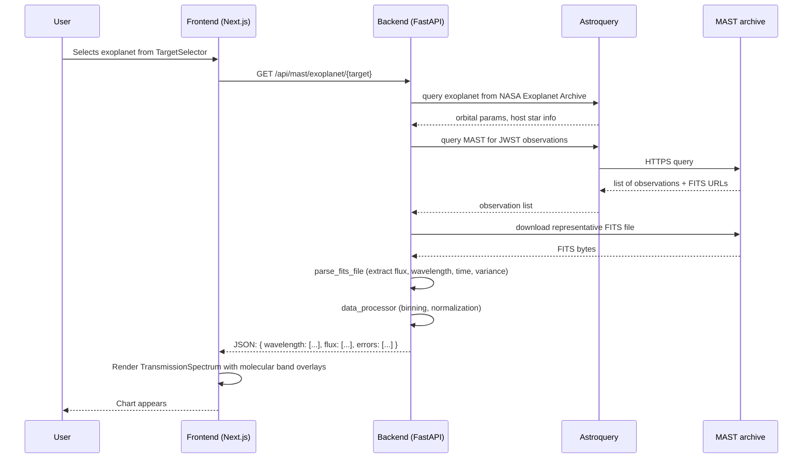

# Architecture

Technical reference for GLIMPSE. The README covers the scientific background and user-facing features; this doc focuses on the engineering structure.

## Two-tier deployment



The frontend (Next.js, deployed to Vercel) handles the UI and orchestrates calls. The backend (FastAPI, deployed to Render) does the heavy lifting: FITS parsing, archive queries, spectral data processing.

The split matches the workload. The frontend is rendered at the edge for low latency. The backend is a long-running Python process that benefits from astropy's substantial NumPy and astroquery dependencies.

## Frontend structure

```
apps/web/
├── src/
│   ├── app/
│   │   ├── page.tsx                Main interface (620 lines)
│   │   ├── layout.tsx              Root layout
│   │   └── api/mast/
│   │       └── [route].ts          Internal API routes proxying to backend
│   ├── components/
│   │   ├── views/
│   │   │   ├── TransmissionSpectrum.tsx    Flux vs wavelength chart
│   │   │   ├── Spectrogram.tsx             2D heatmap (flux × wavelength × phase)
│   │   │   └── Lightcurve.tsx              Flux vs time at selected wavelength
│   │   ├── controls/
│   │   │   ├── MolecularBands.tsx          Toggle H2O, CO2, CH4, etc.
│   │   │   ├── BinningSlider.tsx           Spectral binning 5-100 points
│   │   │   ├── TargetSelector.tsx          Exoplanet picker
│   │   │   ├── ThemeToggle.tsx
│   │   │   └── ExportMenu.tsx              CSV, JSON, PNG export
│   │   ├── accessibility/
│   │   │   ├── SkipLink.tsx
│   │   │   ├── ScreenReaderTable.tsx       Tabular alternative for charts
│   │   │   └── LiveRegion.tsx              Announces chart updates
│   │   └── [layout components]
│   ├── hooks/
│   │   ├── useMediaQuery.ts
│   │   └── useChartDimensions.ts
│   └── lib/                                 Utilities, constants
```

## Backend structure

```
apps/api/
├── app/
│   ├── main.py                     CORS, health check, router mounts
│   ├── routers/
│   │   ├── mast.py                 /api/mast/{targets, real-data, exoplanet, molecular-bands}
│   │   ├── spectra.py              Spectral processing endpoints
│   │   └── upload.py               FITS file upload handler
│   └── services/
│       ├── mast_client.py          MASTClient: featured catalog, exoplanet archive queries
│       ├── fits_parser.py          parse_fits_file() with multi-instrument support
│       └── data_processor.py       Binning, normalization, variability calculation
```

## Data flow



## FITS parser

The most substantial backend component. JWST data comes in FITS files (Flexible Image Transport System), the standard astronomical data format. Different instrument modes use different column naming conventions:

| Instrument | Common flux columns | Common wavelength columns |
|------------|---------------------|---------------------------|
| NIRSpec x1d | `FLUX`, `SCI` | `WAVELENGTH` |
| NIRISS x1d | `FLUX` | `WAVELENGTH` |
| MIRI x1d | `FLUX` | `WAVELENGTH` |
| Legacy IUE | `DATA` | `WAVE`, `LAMBDA` |

`parse_fits_file()` walks each HDU (Header Data Unit), collects metadata, and uses heuristic column-name lists to find the right arrays:

```python
flux_column_candidates = ["FLUX", "SCI", "DATA"]
wave_column_candidates = ["WAVELENGTH", "WAVE", "LAMBDA"]
```

This handles the long tail of inconsistencies between JWST instrument modes without per-instrument special cases.

## Spectral data processing

Three transformations applied to raw FITS data before sending to the frontend:

### Binning

Spectra can have thousands of wavelength points. Web rendering caps useful resolution around 100 points. Binning reduces N raw points to K bins:

```python
def bin_spectrum(wavelengths, fluxes, n_bins):
    # Compute bin edges in wavelength space
    edges = np.linspace(wavelengths.min(), wavelengths.max(), n_bins + 1)
    binned_wave = []
    binned_flux = []
    for i in range(n_bins):
        mask = (wavelengths >= edges[i]) & (wavelengths < edges[i + 1])
        if mask.sum() > 0:
            binned_wave.append(wavelengths[mask].mean())
            binned_flux.append(fluxes[mask].mean())
    return np.array(binned_wave), np.array(binned_flux)
```

The user adjusts `n_bins` via the BinningSlider (range 5-100).

### Normalization

Median normalization divides every flux value by the median of the spectrum. The result is a dimensionless ratio centered around 1.0.

```python
def normalize(fluxes):
    return fluxes / np.median(fluxes)
```

Median is preferred over mean because absorption features pull the mean down, distorting the baseline. Median is robust to outliers.

### Variability calculation

```python
def variability(normalized_fluxes):
    return (normalized_fluxes - 1.0) * 100  # percent deviation from baseline
```

Converts the normalized flux to "percent deviation from the local baseline." Makes weak absorption features visible at a glance (e.g., 1.5% absorption appears as a clear dip; 1% absorption stands out from typical 0.1% noise).

## Molecular band overlays

`molecular_bands.py` defines absorption ranges for each molecule:

```python
MOLECULAR_BANDS = {
    "H2O": [(0.93, 0.98), (1.10, 1.15), (1.35, 1.45), (1.80, 1.95), ...],
    "CO2": [(2.05, 2.10), (4.20, 4.40), (15.0, 17.0), ...],
    "CH4": [(2.20, 2.50), (3.30, 3.45), ...],
    # ... more molecules
}
```

The frontend renders these as shaded vertical bands on the transmission spectrum. The user toggles them via `MolecularBands` controls.

The palette is the [Okabe-Ito colorblind-safe scheme](https://thenode.biologists.com/data-visualization-with-flying-colors/research/), distinguishable across deuteranopia, protanopia, and tritanopia.

## Live MAST integration

The featured-targets list is curated for known exoplanets with public JWST observations. For arbitrary exoplanets, the backend queries:

1. **NASA Exoplanet Archive** (`exoplanet_archive` via `astroquery`) for orbital parameters, host star info.
2. **MAST archive** (`Observations.query_object` via `astroquery`) for available JWST data.

The MASTClient encapsulates both queries and unifies the response shape.

## Accessibility

WCAG 2.1 AA compliant:

- **Skip links**: keyboard users can jump past the navigation directly to the main chart.
- **ARIA labels**: every interactive control has a descriptive label.
- **Screen reader tables**: the visual chart has a tabular alternative that screen readers can announce.
- **Live regions**: when the user toggles a molecular band, a live region announces the change.
- **Colorblind palette**: Okabe-Ito ensures the molecular band overlays are distinguishable for ~8% of male users.
- **Keyboard navigation**: every interaction is reachable without a mouse.

## Build and deployment

| Component | Where | How |
|-----------|-------|-----|
| Frontend | Vercel | `next build` on push to main; CDN-edge cached |
| Backend | Render | Docker container; `uvicorn app.main:app` |
| FITS files | Streamed from MAST | Not stored; streamed and processed in memory |
| Featured catalog | Hardcoded in mast_client.py | Manual curation |

Environment variables:

- Frontend: `NEXT_PUBLIC_API_URL` (URL of the FastAPI backend)
- Backend: `MAST_API_TOKEN` (optional, for authenticated MAST queries)
